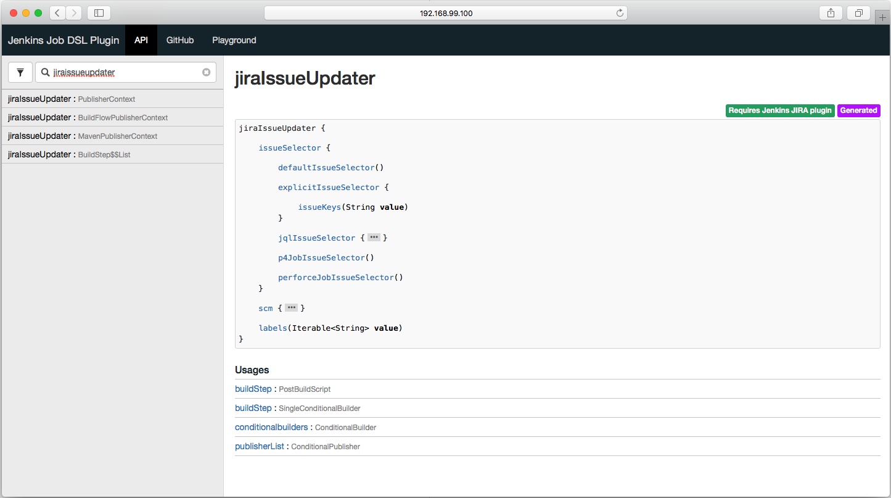
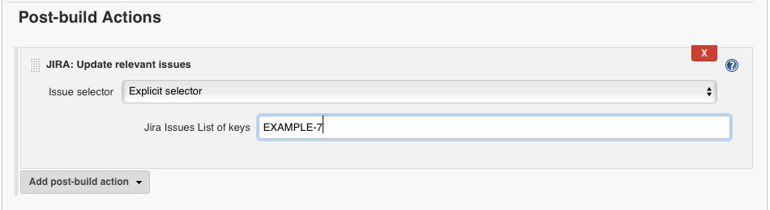

# Make Jenkins Job DSL Code "Work" in Gradle
## Problem
When we use [seedjob](https://wiki.jenkins.io/display/JENKINS/Job+DSL+Plugin) or [Jenkins job DSL](https://jenkinsci.github.io/job-dsl-plugin/) to manage Jenkins jobs, normally we also use [Gradle](https://docs.gradle.org/4.0.1/dsl/) to run building and testing like these examples do: https://github.com/sheehan/job-dsl-gradle-example. However, the job DSL also have a lot of automatically generated [methods]( https://github.com/jenkinsci/job-dsl-plugin/wiki/Automatically-Generated-DSL), they are not available in the generic API viewer, but you can see them in your own API viewer. They have a nice little purple tag on the top left of the page, like this one:They are working just fine when running in Jenkins, but not when build or test with Gradle.

### In Web Interface
The goal is to use the generated method in the above picture to report to JIRA when a Jenkins job has some info to be posted there. We want to use the explicit "selector" since we only want certain issue being updated. In job DSL this is a generated method, the non-generated method does not support explicit selector. It looks like this in web UI:


### Using Generated Method DSL
This is my groovy method:
```
def updateJiraIssue(String jiraIssues) {
  my_job.publishers {
	jiraIssueUpdater {
	  issueSelector {
		explicitIssueSelector {
		  issueKeys(jiraIssues)
		}
	  }
	  scm {
		none()
	  }
	}
  }
}
```
By calling `<object>.updateJiraIssue('EXAMPLE-7')`, I get exactly the same result. The problem is that when building with Gradle, it gives this error:
```
Caused by: groovy.lang.MissingMethodException: No signature of method: javaposse.jobdsl.dsl.helpers.publisher.PublisherContext.jiraIssueUpdater() is applicable for argument types: (jjb.dsl.jobs.Publishers$_updateJiraIssue_closure8$_closure34) values: [jjb.dsl.jobs.Publishers$_updateJiraIssue_closure8$_closure34@59d98b84]
Possible solutions: jiraIssueUpdater()
	at sun.reflect.GeneratedConstructorAccessor19.newInstance(Unknown Source)
	at sun.reflect.DelegatingConstructorAccessorImpl.newInstance(DelegatingConstructorAccessorImpl.java:45)
	at java.lang.reflect.Constructor.newInstance(Constructor.java:526)
	at org.codehaus.groovy.reflection.CachedConstructor.invoke(CachedConstructor.java:83)
	at org.codehaus.groovy.runtime.callsite.ConstructorSite$ConstructorSiteNoUnwrapNoCoerce.callConstructor(ConstructorSite.java:105)
	at org.codehaus.groovy.runtime.callsite.AbstractCallSite.callConstructor(AbstractCallSite.java:263)
	at javaposse.jobdsl.dsl.AbstractExtensibleContext.methodMissing(AbstractExtensibleContext.groovy:19)
...
```
A lot of people are running into the same issue, [some don't know that their method is generated](https://stackoverflow.com/questions/39299271/gradle-test-fail-when-using-slacknotifier-in-jenkins-job-dsl-definition), some does, and it happens a lot with slackNotifier, like [this one](https://stackoverflow.com/questions/39299271/gradle-test-fail-when-using-slacknotifier-in-jenkins-job-dsl-definition).

## Solution is "the Configure Block"
As hinted in the [Automatically-Generated-DSL page](https://github.com/jenkinsci/job-dsl-plugin/wiki/Automatically-Generated-DSL): Jenkins jobs are just xml files, we can use [the configure block](https://github.com/jenkinsci/job-dsl-plugin/wiki/The-Configure-Block) to generate those xml blocks. There is a [tutorial](http://www.devexp.eu/2014/10/26/use-unsupported-jenkins-plugins-with-jenkins-dsl/) suggested by that page. To achieve the same result above but avoid the generated method, here is the code:
```
def updateJiraIssue(String jiraIssues) {
  my_job.configure {
	it / 'publishers' / 'hudson.plugins.jira.JiraIssueUpdater'(plugin: 'jira@2.3.1') {
	  issueSelector(class: 'hudson.plugins.jira.selector.ExplicitIssueSelector') {
		'jiraIssueKeys' {
		  string(jiraIssues)
		}
		issueKeys(jiraIssues)
	  }
	}
	it / publishers / 'hudson.plugins.jira.JiraIssueUpdater'/ scm(class: 'hudson.scm.NullSCM') {}
  }
}
```
You can check what does the generated xml look like by using the "[Jenkins Job DSL Playground](http://job-dsl.herokuapp.com/)", you can copy the above code and modify a little to check the result. What it generates is not exactly the same as what we get by using the generated DSL method like below, but pretty close:
```
<hudson.plugins.jira.JiraIssueUpdater plugin="jira@2.4.2">
	<issueSelector class="hudson.plugins.jira.selector.ExplicitIssueSelector">
		<jiraIssueKeys>
			<string>${JIRA_ISSUES}</string>
		</jiraIssueKeys>
		<issueKeys>${JIRA_ISSUES}</issueKeys>
	</issueSelector>
	<scm class="hudson.scm.NullSCM"/>
	<labels/>
</hudson.plugins.jira.JiraIssueUpdater>
```

## Conclusion
Jenkins got so successful in the CI/CD domain partially because their powerful plugins, but how to test the code especially with automatically generated methods is not easy. But at least we have a way to "hack" through the DSL to get almost what ever when want in the config.xml by the configure block. 
